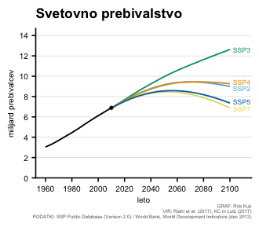
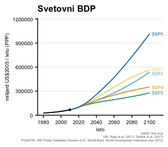

Populacija in GDP
================
Rok Kuk
2023-06-21

## Uvoz knjižnic

``` r
library(tidyverse)
```

    ## ── Attaching core tidyverse packages ──────────────────────── tidyverse 2.0.0 ──
    ## ✔ dplyr     1.1.2     ✔ readr     2.1.4
    ## ✔ forcats   1.0.0     ✔ stringr   1.5.0
    ## ✔ ggplot2   3.4.2     ✔ tibble    3.2.1
    ## ✔ lubridate 1.9.2     ✔ tidyr     1.3.0
    ## ✔ purrr     1.0.1     
    ## ── Conflicts ────────────────────────────────────────── tidyverse_conflicts() ──
    ## ✖ dplyr::filter() masks stats::filter()
    ## ✖ dplyr::lag()    masks stats::lag()
    ## ℹ Use the conflicted package (<http://conflicted.r-lib.org/>) to force all conflicts to become errors

``` r
library(cowplot)
```

    ## 
    ## Attaching package: 'cowplot'
    ## 
    ## The following object is masked from 'package:lubridate':
    ## 
    ##     stamp

``` r
library(here)
```

    ## here() starts at /Users/rokuk/Documents/Work/BFUL/SSP-data-slo

``` r
library(ggokabeito)
library(colorspace)
```

## Uvoz podatkov

``` r
hist <- read_csv(here("data", "WDI.csv")) %>%
    filter(`Country Code` == "WLD")
```

    ## Rows: 309755 Columns: 57
    ## ── Column specification ────────────────────────────────────────────────────────
    ## Delimiter: ","
    ## chr  (4): Country Name, Country Code, Indicator Name, Indicator Code
    ## dbl (53): 1960, 1961, 1962, 1963, 1964, 1965, 1966, 1967, 1968, 1969, 1970, ...
    ## 
    ## ℹ Use `spec()` to retrieve the full column specification for this data.
    ## ℹ Specify the column types or set `show_col_types = FALSE` to quiet this message.

``` r
histgdp <- filter(hist, `Indicator Code` == "NY.GDP.MKTP.PP.KD") %>%
    pivot_longer(cols=5:57, names_to="leto", values_to="value") %>%
    select(leto, value) %>%
    drop_na() %>%
    slice(which(row_number() %% 5 == 1)) %>%
    mutate(value = value / 1000000000) 

histpop <- filter(hist, `Indicator Code` == "SP.POP.TOTL") %>%
    pivot_longer(cols=5:57, names_to="leto", values_to="value") %>%
    select(leto, value) %>%
    slice(which(row_number() %% 5 == 1)) %>%
    mutate(value = value / 1000000)

rm(hist)

base <- read_csv(here("data", "SspDb_compare_regions_2013-06-12.csv")) %>%
    filter(REGION == "World") %>%
    select(-REGION)
```

    ## Rows: 37555 Columns: 46
    ## ── Column specification ────────────────────────────────────────────────────────
    ## Delimiter: ","
    ## chr  (5): MODEL, SCENARIO, REGION, VARIABLE, UNIT
    ## dbl (21): 2000, 2005, 2010, 2015, 2020, 2025, 2030, 2035, 2040, 2045, 2050, ...
    ## lgl (20): 1950, 1955, 1960, 1965, 1970, 1975, 1980, 1985, 1990, 1995, 2105, ...
    ## 
    ## ℹ Use `spec()` to retrieve the full column specification for this data.
    ## ℹ Specify the column types or set `show_col_types = FALSE` to quiet this message.

``` r
IAM <- read_csv(here("data", "IAM/SSP_IAM_V2_201811.csv")) %>%
    filter(REGION == "World") %>%
    select(-REGION)
```

    ## Rows: 84353 Columns: 16
    ## ── Column specification ────────────────────────────────────────────────────────
    ## Delimiter: ","
    ## chr  (5): MODEL, SCENARIO, REGION, VARIABLE, UNIT
    ## dbl (11): 2005, 2010, 2020, 2030, 2040, 2050, 2060, 2070, 2080, 2090, 2100
    ## 
    ## ℹ Use `spec()` to retrieve the full column specification for this data.
    ## ℹ Specify the column types or set `show_col_types = FALSE` to quiet this message.

## Preoblikovanje podatkov za grafe

``` r
populacija_proj <- filter(base, VARIABLE == "Population" & MODEL == "IIASA-WiC POP") %>%
    select(-UNIT, -VARIABLE, -MODEL) %>%
    pivot_longer(cols=2:42, names_to="leto", values_to="value") %>%
    drop_na()
populacija_proj$SCENARIO <- factor(populacija_proj$SCENARIO, levels=c("SSP1_v9_130115", "SSP2_v9_130115", "SSP3_v9_130115", "SSP4d_v9_130115", "SSP5_v9_130115")) %>%
    fct_recode("SSP1" = "SSP1_v9_130115", 
               "SSP2" = "SSP2_v9_130115", 
               "SSP3" = "SSP3_v9_130115", 
               "SSP4" = "SSP4d_v9_130115", 
               "SSP5" = "SSP5_v9_130115")
histpop$SCENARIO <- "preteklost"
populacija <- full_join(histpop, populacija_proj) %>%
    mutate(SCENARIO=fct_relevel(SCENARIO, c("preteklost", "SSP1", "SSP2", "SSP3", "SSP4", "SSP5")))
```

    ## Joining with `by = join_by(leto, value, SCENARIO)`

``` r
populacija$leto <- as.integer(populacija$leto)

GDP_proj <- filter(base, VARIABLE == "GDP|PPP" & MODEL == "OECD Env-Growth") %>%
    select(-UNIT, -VARIABLE, -MODEL) %>%
    pivot_longer(cols=2:42, names_to="leto", values_to="value") %>%
    drop_na()
    
GDP_proj$SCENARIO <- factor(GDP_proj$SCENARIO, levels=c("SSP1_v9_130325", "SSP2_v9_130325", "SSP3_v9_130325", "SSP4_v9_130325", "SSP5_v9_130325")) %>%
    fct_recode("SSP1" = "SSP1_v9_130325", 
               "SSP2" = "SSP2_v9_130325", 
               "SSP3" = "SSP3_v9_130325", 
               "SSP4" = "SSP4_v9_130325", 
               "SSP5" = "SSP5_v9_130325")
histgdp$SCENARIO <- "preteklost"
histgdp$leto <- as.integer(histgdp$leto)
GDP_proj$leto <- as.integer(GDP_proj$leto)
GDP <- full_join(histgdp, GDP_proj) %>%
    mutate(SCENARIO=fct_relevel(SCENARIO, c("preteklost", "SSP1", "SSP2", "SSP3", "SSP4", "SSP5")))
```

    ## Joining with `by = join_by(leto, value, SCENARIO)`

``` r
labels_pop <- full_join(filter(populacija, leto == 2100),
                       tibble(
                           SCENARIO = c("SSP1", "SSP2", "SSP3", "SSP4", "SSP5"),
                           nudge_y = c(-0.1, -0.17, 0, 0.15, 0.1)))
```

    ## Joining with `by = join_by(SCENARIO)`

``` r
labels_gdp <- full_join(filter(GDP, leto == 2100),
                        tibble(
                          SCENARIO = c("SSP1", "SSP2", "SSP3", "SSP4", "SSP5"),
                          nudge_y = c(7000, -17000, 0, 0, 0)))
```

    ## Joining with `by = join_by(SCENARIO)`

## Grafi

``` r
labelsize <- 7

ggplot(data = populacija, mapping = aes(leto, value/1000, color=SCENARIO, group=SCENARIO)) +
    geom_line(linewidth = 0.6) +
    geom_text(
        data = labels_pop,
        aes(x = leto + 9, y = value/1000 + nudge_y, label = SCENARIO),
        size = unit(labelsize*0.3, "pt")) +
    scale_y_continuous(expand = expansion(mult = c(0, 0.05)), limits = c(0, 14), breaks = seq(0, 14, 2)) +
    scale_x_continuous(breaks = seq(1960, 2100, 20)) +
    xlab("leto") + 
    ylab("milijard prebivalcev") +
    labs(title = "Svetovno prebivalstvo", caption="GRAF: Rok Kuk\nVIR: Riahi et al. (2017), KC in Lutz (2017)\n  PODATKI: SSP Public Database (Version 2.0) / World Bank, World Development Indicators (dec 2012)") + 
    theme_half_open() +
    background_grid(major="y", size.major = 0.2) +
    scale_color_manual(values=c("#000000", darken("#F0E442", 0.03), "#56B4E9", "#009E73", "#E69F00", "#0072B2")) +
    theme(axis.text = element_text(size=labelsize),
          axis.title = element_text(size=labelsize),
          title = element_text(size=labelsize*1.5),
          plot.caption = element_text(size=labelsize*0.6, color = "#666666", margin=margin(0,0,0,0)),
          plot.background = element_rect(fill = "#FFFFFF")) +
    annotate("point", x = 2010, y = 6.894378, colour = "#000000", size=1) +
    guides(color="none")

ggsave2(here("output", "pdf", "populacija.pdf"), width=figwidth, height=figheight, units="cm")
ggsave2(here("output", "png", "populacija.png"), width=figwidth, height=figheight, units="cm", dpi=400)
```



``` r
ggplot(data = GDP, mapping = aes(leto, value, color=SCENARIO, group=SCENARIO)) +
    geom_line(linewidth = 0.6) +
    geom_text(
        data = labels_gdp,
        aes(x = leto + 9, y = value + nudge_y, label = SCENARIO),
        size = unit(labelsize*0.3, "pt")) +
    scale_y_continuous(expand = expansion(mult = c(0, 0.05)), limits = c(0, 1150*1000)) +
    scale_x_continuous(breaks = seq(1960, 2100, 20)) +
    xlab("leto") + 
    ylab("milijard US$2005 / leto (PPP)") +
    labs(title = "Svetovni BDP", caption="GRAF: Rok Kuk\nVIR: Riahi et al. (2017), Dellink et al. (2017)\n  PODATKI: SSP Public Database (Version 2.0) / World Bank, World Development Indicators (dec 2012)") + 
    theme_half_open() +
    background_grid(major="y", size.major=0.2) +
    scale_color_manual(values=c("#000000", darken("#F0E442", 0.03), "#56B4E9", "#009E73", "#E69F00", "#0072B2")) +
    theme(axis.text = element_text(size=labelsize),
          axis.title = element_text(size=labelsize),
          title = element_text(size=labelsize*1.5),
          plot.caption = element_text(size=labelsize*0.6, color = "#666666", margin=margin(0,0,0,0)),
          plot.background = element_rect(fill = "#FFFFFF")) +
    annotate("point", x = 2010, y = 67.66640*1000, colour = "#000000", size=1) +
    geom_line(data=histgdp, mapping=aes(leto, value)) +
    guides(color="none")

ggsave2(here("output", "pdf", "GDP.pdf"), width=figwidth, height=figheight, units="cm")
ggsave2(here("output", "png", "GDP.png"), width=figwidth, height=figheight, units="cm", dpi=400)
```


